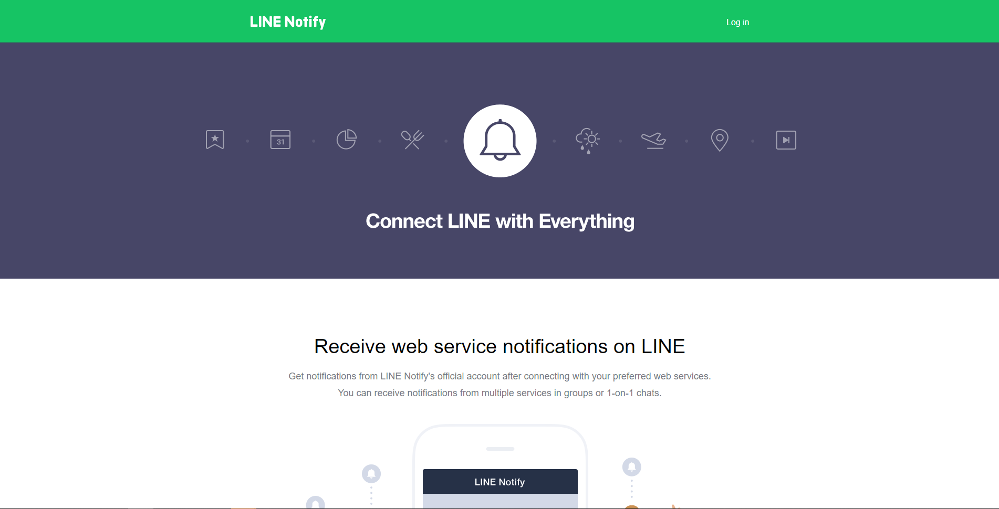
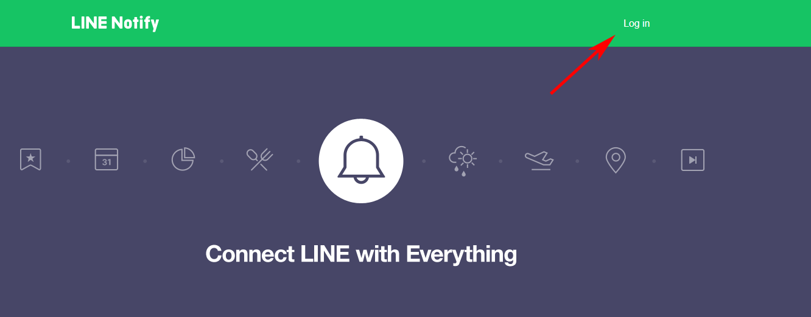
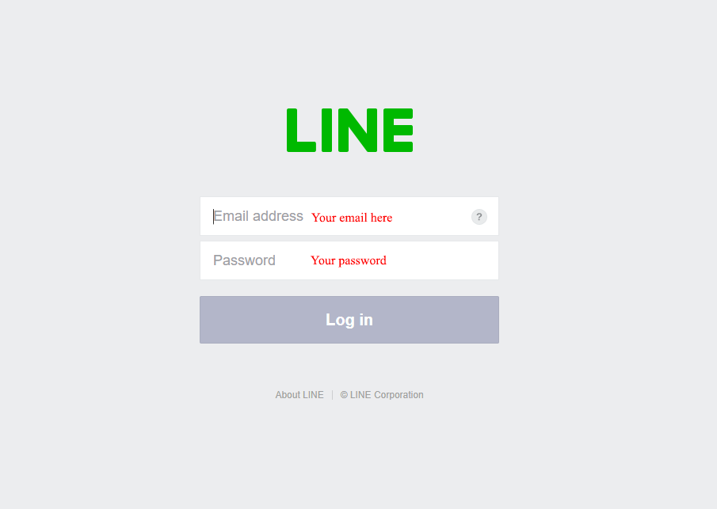
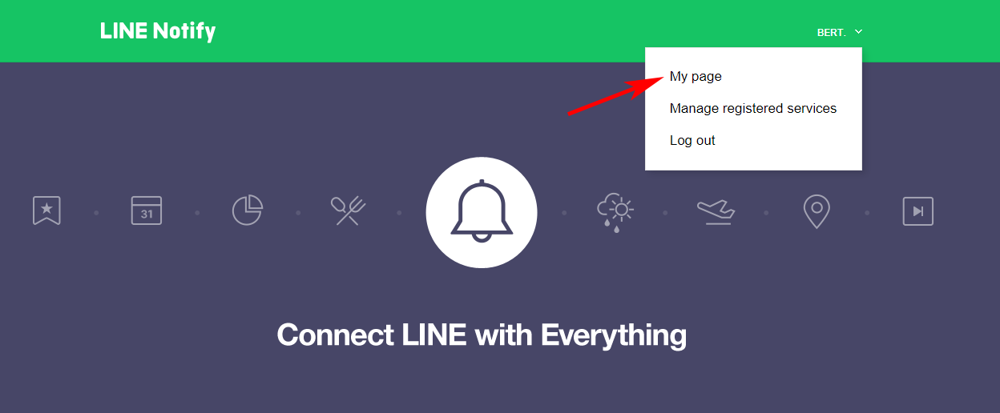
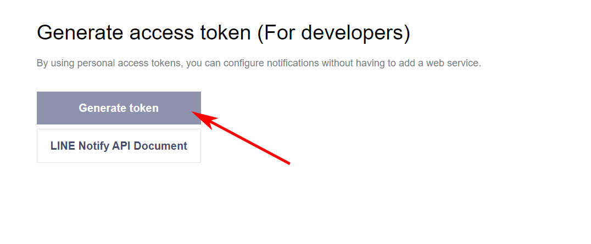
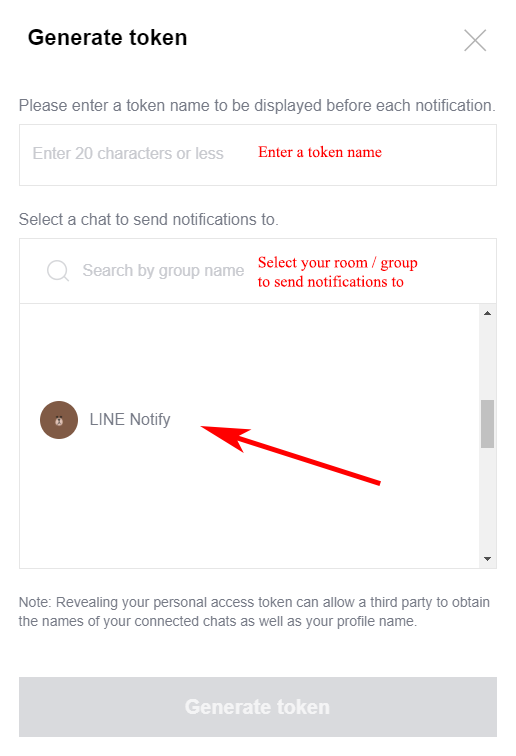
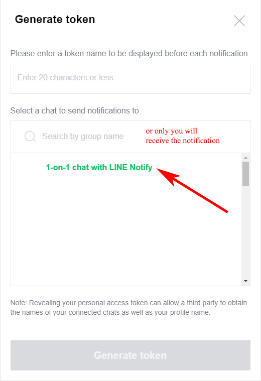
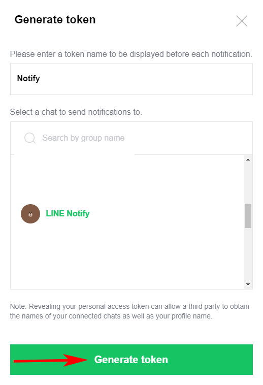
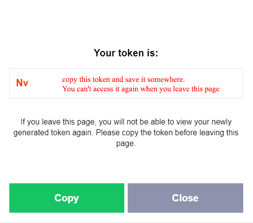

# Line Notify API
Implementation of Line Notify API. Full documentation please refer to [here](https://notify-bot.line.me/doc/en/).

## How to get token?

Follow this instruction to get your `NOTIFY_ACCESS_TOKEN`:
1. Open [LINE Notify](https://notify-bot.line.me/en/)


2. Login with your LINE Account



3. Select **My Page**


4. Select **Generate Token**





5. Copy your `NOTIFY_ACCESS_TOKEN` and store it somewhere. You can't access it again when you leave this page


## Installation
```bash
pip install git+https://github.com/herbertendrian/linenotify
```
## Usage

```python
from linenotify import lineNotifyAPI

api = lineNotifyAPI("NOTIFY_ACCESS_TOKEN")

# Send text message (1000 characters max)
api.sendTextMessage('Hello World')

# Send image message (PNG and JPEG only)
api.sendImageMessage('Cute cat image', 'cuteCat.jpg')

# Send image message with URL (Max size for thumbnail and full size are 240×240px, 2048×2048px JPEG respectively)
api.sendImageMessageWithURL('Cute cat image', 'https://i.postimg.cc/J4yMmNYR/cuteCat.jpg', 'https://i.postimg.cc/J4yMmNYR/cuteCat.jpg')

# Send sticker message
api.sendStickerMessage('Hello World', 1, 1)
```